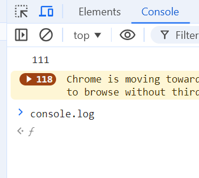
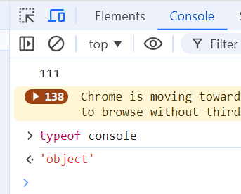
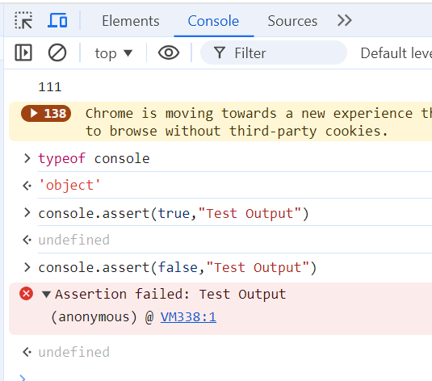

## Objects

In this activity, we'll explore some additional concepts that you'll encounter in more depth later on in the course.

Open the Chrome devtools Console, type in `console.log` and then hit enter

What output do you get?

Now enter just `console` in the Console, what output do you get back?

Try also entering `typeof console`

Answer the following questions:

What does `console` store?
What does the syntax `console.log` or `console.assert` mean? In particular, what does the `.` mean?

`console` is a built-in JS object

`console.log()` is a `console` method that prints data to the console

`console.assert()` is a `console` method that prints objects or messages to the console if the first parameter evaluates to false

`.` is a separator between an `object` and its `methods`/`properties` and `submethods`/`subproperties`

